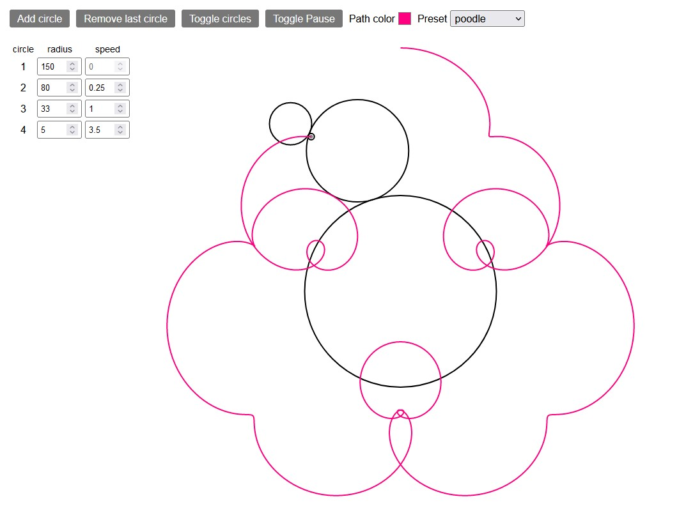

# Spirograph

In this [spirograph](https://en.wikipedia.org/wiki/Spirograph)-like simulation we start with a fixed circle in the middle. Then we add another circle which moves around its boundary. We repeat this process any number of times. This leads to a number of complex curves.

The interface lets you adjust speed and radius of each circle. You can also choose from a selection of interesting presets.

The app is made with Svelte in order to simplify the interactivity. The drawing is done via SVGs.